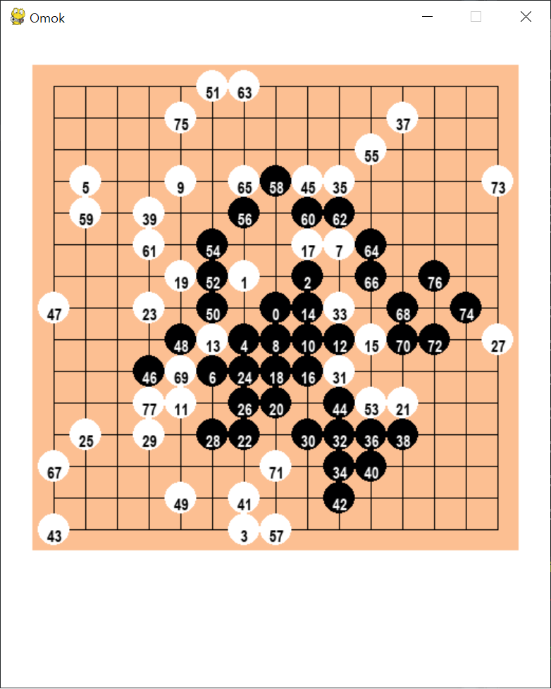
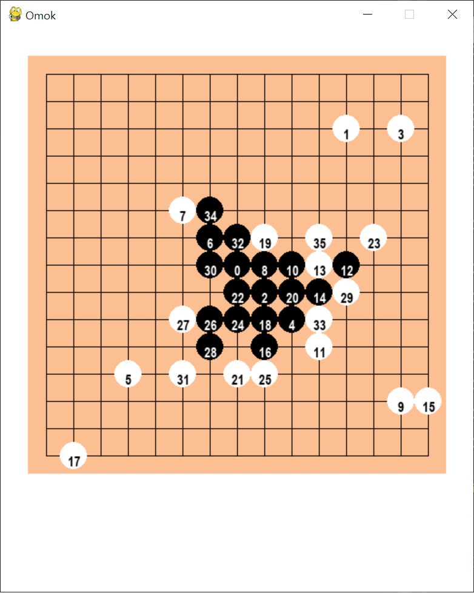

# gomokuAI

reference : [AlphaGomoku: An AlphaGo-based Gomoku Artificial Intelligence using Curriculum Learning](https://arxiv.org/pdf/1809.10595, "alpha gomoku")

***

### implementation

#### Play

```
python index.py
```

#### Train

```
python Train.py
```

# !!!아직 훈련 성능 검증 안됨!!!
### (pretrained model 쓰면 작동)

---
<strike>
  
## 5월 7일부터 gcp에서 훈련중

훈련 안한 모델



훈련 2일 한 모델(200epoch) [21/05/09]




### 중간평가

[21/05/09]

훈련 안한 모델도 초반엔 4줄을 잘 막기는 하나 후반 갈수록 랜덤성이 짙어진다.

아마도 훈련을 안해도 바둑돌이 적을때 MCTS로 우연히 막은것 같다.

훈련을 좀 한 뒤에는 상당히 후반에도 4줄은 잘 막는다.

그런데 이게 훈련이 잘 되는건지는 모르겠다.

1주정도 지나도 똑같으면 다른 방식으로 훈련하거나 훈련방법에서 잘못된 부분이 있는지 검토해야겠다.

(최악의 경우에는 다시 구현해야할수도... 너무 옛날에 구현한거라 기억이 잘 안난다...)

</strike>

# 알고리즘 오류 발견으로 다시 짤 예정
